University of Engineering & Technology Mardan 

**Department of Computer Software Engineering** 

Project Report submitted in the partial fulfilment of the requirements for the degree of B.Sc. Computer Software Engineering 

Community Cleanup

|
** 

Submitted by: 
||
| :- | :- |
|1. Hikmat Bangash|Reg # 19MDSWE050|
|2. Ihtisham ul Haq|Reg # 19MDSWE057 |
|3\.  Ayesha Aurangzeb|Reg # 19MDSWE092 |

Supervised by:  Engr. Lubna Gul

External Supervised by:  Arsala Bangash

**

**Declaration**

We hereby declare that this project report entitled COMMUNITY CLEANUP, submitted to the DEPARTMENT OF COMPUTER SOFTWARE ENGINEERING, is a record of an original work done by us under the guidance of Supervisor ENGR. LUBNA GUL and that no part has been plagiarized without citations. Also, this project work is submitted in partial fulfilment of the requirements for the degree of BSc COMPUTER SOFTWARE ENGINEERING.

|**Team Members** |**Signature** |
| :- | :-: |
|Hikmat Bangash|\_\_\_\_\_\_\_\_\_\_\_\_\_\_\_\_\_\_\_\_\_ |
|Ihtisham ul Haq  |\_\_\_\_\_\_\_\_\_\_\_\_\_\_\_\_\_\_\_\_\_ |
|Ayesha Aurangzeb|\_\_\_\_\_\_\_\_\_\_\_\_\_\_\_\_\_\_\_\_\_ |
| | |
| | |
|**Supervisor**  |**Signature** |
||**\_\_\_\_\_\_\_\_\_\_\_\_\_\_\_\_\_\_\_\_** |
|
**Date:** 

**\_\_\_\_\_\_\_\_\_\_\_\_\_\_\_\_\_\_\_\_\_\_\_\_** 
|** |
|** |** |

**Abstract**

This project presents the development of a comprehensive system aimed at addressing the waste management and complaint management issues in WSSCs (Water and Sanitation Services Companies) across KPK. The system offers an integrated platform for citizens to report various types of complaints related to garbage, sanitary issues, water supply, WSSC staff, and other relevant concerns. It facilitates the automation of the existing manual complaint system, streamlining the process and enhancing user experience.

The system's key features include a user-friendly interface for easy complaint registration, a centralized database for efficient complaint management, and communication channels between citizens and WSSC authorities. Through the system, users can select complaint types, provide detailed information, and attach media files to support their complaints. The system tracks the status of each complaint and enables notifications to keep users updated on the progress and resolution.

To ensure the effectiveness and usability of the system, extensive usability testing and evaluation have been conducted, including guerrilla usability testing with diverse users. The findings have revealed positive outcomes, demonstrating the system's ability to enhance citizen engagement, expedite complaint resolution, and contribute to a cleaner and healthier environment.

Future work includes the development of a mobile application to extend accessibility, integration with the existing WSSC infrastructure, enhanced reporting and analytics capabilities, expansion to other WSSCs, integration of advanced technologies, and community engagement programs. These efforts will further enhance the system's functionality, adaptability, and impact, providing a robust framework for efficient waste and complaint management.

**FYP Report Approval** 

The Department of Computer Software Engineering, University of Engineering & Technology Mardan accepts the report in the present form and it satisfies the entire requirements of the Final Year Project (FYP). 

**Approval of FYP Coordinator:** 

**Name:** Engr Muhammad Ishaq** 
**

**Signature: \_\_\_\_\_\_\_\_\_\_\_\_\_\_\_\_\_\_\_\_\_\_\_** 
**

**

**Approval of Chairman:** 

**Name:** Prof. Dr. Ibrar Ali Shah 
**

**Signature: \_\_\_\_\_\_\_\_\_\_\_\_\_\_\_\_\_\_\_\_\_\_\_** 
**

**Plagiarism Check Report** 

Engr. Lubna Gul

Name of Supervisor:                             				Signature

**Acknowledgment** 

We would like to extend our heartfelt thanks to the divine blessings of Allah, which empowered and motivated us to embark on and successfully accomplish this project. We would also like to convey our profound gratitude to our esteemed supervisor, Engr. Lubna Gul, whose invaluable mentorship and steadfast assistance have been indispensable throughout this remarkable journey.

**List of Abbreviations** 

**Abbreviation 	 	 	                                     Expansion** 

WSSC                                                    Water and Sanitation Service Company

TMA                                                      Tehsil Municipal Administration

PMRU                                                    Performance Management and Reforms 

API                                                         Application Programming Interface

UML                                                       Unified Modelling Language

PWA                                                       Progressive Web App

SDG                                                        Software Development Goals

CEP                                                         Complex Engineering Problem

**Table of Content**
#
[Chapter-1:      Introduction	1****](#_toc140019310)**

[1.1      Background	1](#_toc140019311)

[1.2      Purpose	2](#_toc140019312)

[1.3      Scope	2](#_toc140019313)

[1.4      Objectives	2](#_toc140019314)

[1.5      Sustainable development Goals	2](#_toc140019315)

[1.6      Final Year Project to Complex Engineering Problem Mapping	4](#_toc140019316)

[1.7	FYP Report Outline	4](#_toc140019317)

[**Chapter-2:**     **Literature Review	5****](#_toc140019318)

[2.1      Sensoneo Citizenship App	5](#_toc140019319)

[2.2      Safa pekhawar	5](#_toc140019320)

[2.3      Marasatyal	6](#_toc140019321)

[2.4      Swachh Delhi and I clean India	6](#_toc140019322)

[2.5      Solid waste management system	7](#_toc140019323)

[2.6      Analysis of Literature	7](#_toc140019324)

[**Chapter-3:     Problem Definition	9****](#_toc140019325)

[3.1      Problem Statement	9](#_toc140019326)

[3.2      Proposed Solution	9](#_toc140019327)

[**Chapter- 4:    Methodology	10****](#_toc140019328)

[4.1      Requirement Engineering Phase	10](#_toc140019329)

[4.1.1      Existing Systems	10](#_toc140019330)

[4.1.2      Multiple Visits	10](#_toc140019331)

[4.1.4      Prototypes	11](#_toc140019332)

[4.2      Software Process Model	14](#_toc140019333)

[4.2.1      Agile Software Model	14](#_toc140019334)

[4.3      Tools and Technology	15](#_toc140019335)

[4.3.1      Next	15](#_toc140019336)

[4.3.2      Node	15](#_toc140019337)

[4.3.3      Express	16](#_toc140019338)

[4.3.4      MongoDB	16](#_toc140019339)

[4.3.5      GitLab	16](#_toc140019340)

[4.3.6      Figma	16](#_toc140019341)

[4.3.7      VS code	17](#_toc140019342)

[4.3.8       Trello	17](#_toc140019343)

[4.3.10      Google Docs	17](#_toc140019344)

[4.3.11      Postman	17](#_toc140019345)

[**Chapter- 5:   Detailed Design and Analysis	18****](#_toc140019346)

[5.1      System Architecture	18](#_toc140019347)

[5.1.1         Functional Requirements	18](#_toc140019348)

[5.1.2      Non-Functional Requirements	25](#_toc140019349)

[5.2      Architectural Design Approach	26](#_toc140019350)

[5.2.1      Model View Controller (MVC) Design Pattern	26](#_toc140019351)

[5.3      UML Diagrams	27](#_toc140019352)

[5.3.1      Activity Diagram	27](#_toc140019353)

[5.3.2      Use case diagram	31](#_toc140019354)

[5.3.3      Entity Relationship Diagram	36](#_toc140019355)

[**Chapter-6:     Implementation and Testing	38****](#_toc140019356)

[6.1      Implementation Tools	38](#_toc140019357)

[6.2      Implementation technology	38](#_toc140019358)

[6.3      Folder Structure	39](#_toc140019359)

[6.3.1      TurboRepo (Root directory)	39](#_toc140019360)

[6.3.2      Client side	40](#_toc140019361)

[6.3.3      Dashboard Folder Structure	40](#_toc140019362)

[6.3.4      Server-side Folder Structure	41](#_toc140019363)

[6.4      Visual Flow of the App	42](#_toc140019364)

[6.4.1      Client side - Citizen	43](#_toc140019365)

[6.4.2      Admin Dashboard	46](#_toc140019366)

[6.4.3      Supervisor Panel	50](#_toc140019367)

[6.5      Testing	52](#_toc140019368)

[6.5.1      White box testing	52](#_toc140019369)

[6.5.2      Black box testing	54](#_toc140019370)

[**Chapter-7:   Results and Discussion	57****](#_toc140019371)

[7.1      Results and Discussion Overview	57](#_toc140019372)

[7.1.1      Guerilla Usability Testing	58](#_toc140019373)

[**Chapter-8:    Conclusion and Future Work	60****](#_toc140019374)

[8.1      Conclusion	60](#_toc140019375)

[8.2      Future Work	60](#_toc140019376)

[8.3      References	61](#_toc140019377)

**

**List of Figures**

[Figure 4.1 Snapshot of Initial Prototype	12](#_toc139884742)

[Figure 4.2 Other Snapshot of Initial Prototype	12](#_toc139884743)

[Figure 4.3 Snapshot of final Prototype	13](#_toc139884744)

[Figure 4.4 Other Snapshots of final Prototype	14](#_toc139884745)

[Figure 5.1 Citizen Activity Diagram	28](#_toc139884746)

[Figure 5.2 Admin Activity Diagram	29](#_toc139884747)

[Figure 5.3 Super admin Activity Diagram	30](#_toc139884748)

[Figure 5.4 Supervisor Activity Diagram	31](#_toc139884749)

[Figure 5.5 Citizen use case	32](#_toc139884750)

[Figure 5.6 Admin use case	33](#_toc139884751)

[Figure 5.7 Supervisor use case	34](#_toc139884752)

[Figure 5.8 Super Admin use case	35](#_toc139884753)

[Figure 5.10 Entity Relationship diagram	36](#_toc139884754)

[Figure 6.1 Folder Structure	39](#_toc139884755)

[Figure 6.2 Folder Structure-client side	40](#_toc139884757)

[Figure 6.3 Folder Structure-dashboard	41](#_toc139884759)

[Figure 6.4 Folder Structure-server side	42](#_toc139884761)

[Figure 6.5 Registration/login screen	43](#_toc139884762)

[Figure 6.7 Complaint form	44                       
Figure 6.6 Home screen	44](#_toc139884763)

[Figure 6.8 Complaint tracking page	45         
Figure 6.9 View complaints page	45](#_toc139884764)

[Figure 6.10 Update Profile	46](#_toc139884765)

[Figure 6.11 Home page	47](#_toc139884766)

[Figure 6.12 All Complaints page	47](#_toc139884767)

[Figure 6.13 Specific complaint	48](#_toc139884768)

[Figure 6.14 View Supervisors page	48](#_toc139884769)

[Figure 6.15 Register supervisor	49](#_toc139884770)

[Figure 6.16 View all feedback	49](#_toc139884771)

[Figure 6.17 Supervisor’s sign-in	50](#_toc139884772)

[Figure 6.18 All complaints	51             
Figure 6.19 Assigned complaints	51](#_toc139884773)

[Figure 6.20 Complaint details	51](#_toc139884774)

[Figure 6.22 Resolved complaints	52         
Figure 6.22 Supervisors profile card	52](#_toc139884775)

[Figure 6.23 Unit testing-1	53](#_toc139884776)

[Figure 6.24 Unit testing-2	54](#_toc139884777)

**

**List of Tables**

[Table 1.1 Sustainable Development Goals	3](#_toc140019886)

[Table 2.1 Literature Review Analysis	8](#_toc140019887)

[Table 5.1 Registration	19](#_toc140019888)

[Table 5.2 Login	19](#_toc140019889)

[Table 5.3 Make Complaint	20](#_toc140019890)

[Table 5.4 Feedback	20](#_toc140019891)

[Table 5.5 View Complaint	21](#_toc140019892)

[Table 5.6 Update profile	21](#_toc140019893)

[Table 5.7 View Complaints	22](#_toc140019894)

[Table 5.8 Assign to Supervisor	22](#_toc140019895)

[Table 5.9 Add statement	22](#_toc140019896)

[Table 5.10 View users	23](#_toc140019897)

[Table 5.11.1 Update Supervisors	23](#_toc140019898)

[Table 5.11.2 Add Supervisors	23](#_toc140019899)

[Table 5.11.3 Delete Supervisors	24](#_toc140019900)

[Table 5.11.2 view Supervisors	24](#_toc140019901)

[Table 5.12 View assigned complaints	24](#_toc140019902)

[Table 5.13 Complaints resolution feedback	25](#_toc140019903)

[Table 6.1 Test case for registration	55](#_toc140019904)

[Table 6.2 Test case for login	55](#_toc140019905)

[Table 6.3 Test case for filing complaint	55](#_toc140019906)

[Table 6.4 Test case for update profile	56](#_toc140019907)

[Table 6.5 Test case for user feedback	56](#_toc140019908)

[Table 7.1 Feedback Received from users	59](#_toc140019909)

xiii

# **Chapter-1:	   Introduction** 
## **1.1      Background**
People living on earth depend on nature to provide them with the resources they need to survive: air, water, food, fibre, medicines, and building materials. As humans, we are responsible for distorting the real value of nature, not only for ourselves but for future generations. Pakistan generates approximately 49.6 million tons of solid waste annually, with a 2.4 million ton increase in solid waste generated each year [1]. In comparison to other developing countries, Pakistan has very poor waste management infrastructure, and waste is irregularly collected and improperly treated, leading to serious environmental and health problems.  As a result, garbage accumulates on roadsides, in sewers, and in other public areas, and it has become commonplace to incinerate garbage, resulting in the release of dangerous toxins and threatening human and environmental health. Of the few existing landfills, even fewer are operational. Uncollected waste is creating serious public health risks by clogging drains, forming stagnant pools, providing breeding grounds for mosquitoes and flies, and leading to the risk of malaria and cholera. [2]. 

Pakistan is a developing country, and the main problem with garbage collection is that most of the garbage is not collected, when municipalities take care of disaster areas, some places are overlooked, and garbage continues to pile up.

Furthermore, more than half of the people in Pakistan are facing serious sanitation problems as well. A very large percentage of people are deprived of clean water, leading to serious health conditions. There is a lack of awareness about how severe garbage and water sanitation problems can become for healthy survival. The waste and water problems persist, but the main issue lies in the lack of management in Pakistan. Management encompasses staff handling the issues and raising awareness, among other aspects.

To solve these issues, we have developed a system that allow citizens to make complaints of different types, which highlights problems faced by common citizens. 
## **1.2      Purpose**
This project aims to revolutionize the operations of water and sanitation services companies (WSSCs) by introducing a comprehensive digital solution in the form of a Progressive Web App (PWA). Our solution encompasses various crucial aspects, including the management of complaints related to solid waste, water sanitation, miscellaneous issues, and other categories falling within the purview of WSSC organizations. Moreover, it facilitates the effective supervision of personnel, tracking citizen feedback, and monitoring employee activities and responsibilities.

## **1.3      Scope**
- This system is a generic system developed for all the WSSCs.
- This system allows citizens to file various types of complaints, including those related to water supply, solid waste, wastewater, WSSC staff, miscellaneous issues, and other categories falling within the purview of WSSC organizations.
- This system provides a mode of communication between citizens and relevant WSSC organization through filing complaints, addressing, and managing them.

## **1.4      Objectives**
The main objectives of our proposed system are as follows: 

- To develop a complaint management system for all WSSCS in KPK.
- To integrate with their existing systems.
- To equip citizens with a functional and convenient app to file complaint.

## **1.5      Sustainable development Goals**
Our system is associated with 3 out of the 17 SDG goals, which include, good health and well-being, sustainable cities and communities, and clean water and sanitation, because the aim of our project in sustainable development is to achieve a clean and healthy environment. The justification for achieving these goals is given below in Table 1.1.

*Table 1.1 Sustainable Development Goals*

| |**Sustainable Development Goals (SDGs)**||
| :- | :- | :- |
|**G    Goal #**|**Description**|`   `**Justification**|
|**Goa Goal 13**|
**GO GOOD HEALTH &       WELL-BEING**

Ensure healthy lives and promote well- Being for all at all ages.

 
|A polluted environment can cause serious health conditions such as asthma, bronchitis, emphysema, and possibly cancer. The goal of this project “community cleanup” is to clean the environment, which can lead to good mental and physical health if the rate of dumping garbage and its collection is equalized. |
|**Goa Goal 11**|
**SUSTAINABLE    CITIES AND**

**COMMUNITIES**

Make cities and human    settlements inclusive, safe, resilient and sustainable.

 
|
This project contributes to a clean and safe environment, by reducing pollution, and making the communities environmentally sustainable in terms of cleanliness and efficiency.

 

|
|**GG Goal 6**|
**CLEAN WATER AND SANITATION**

Ensure availability and sustainable management of water and sanitation of all

 
|
This project is concerned and linked with WSSC, Water and Sanitation Company Service-WSSC is a company that provides clean water to different organizations, groups, and individuals through various means such as pumps, reservoirs, and pipes.

And also ensures improvement in water and sanitation and addresses the needs of common people.
|

## **1.6      Final Year Project to Complex Engineering Problem Mapping** 
The developed project The Community clean up aligns with several key attributes of the CEP system, the detailed report showing the justification is shown in Annexure-A.

7. ##       **FYP Report Outline**
This final year project report contains eight chapters. Each chapter contains different sections. A short description of each chapter is given below:

- **Chapter 1: Introduction**

The purpose of this chapter is to introduce the project that has been developed. It contains background, purpose, scope, objective, and FYP report outline.

- **Chapter 2: Literature Review**

The purpose of this chapter is to explain the project case study. It highlights some historical background as well as existing systems and technologies.

- **Chapter 3: Problem Definition**

This chapter discusses all the issues and problems that require timely action to improve the situation and propose a possible solution.

- **Chapter 4: Methodology and implementation**

The chapter discusses the methods, approaches, tools, techniques, algorithms, and other aspects of a solution with sufficient detail.

- **Chapter 5: Detailed Design and Analysis**

This chapter presents a high-level overview of the system. Furthermore, it explains how the functionality and responsibilities of the system were partitioned to develop a smooth system.

- **Chapter 6: Result and Discussion**

This chapter extends light on the comprehensive assessment of the solution by employing figures and graphs.

- **Chapter 7: Conclusion and Future Work**

This chapter briefly tells us how the proposed solution addressed the problem, as well as the recommendations and directions that must be addressed in the future
# **Chapter-2:     Literature Review** 
This chapter gives a detailed review of some of the relevant work done and shows a few of the already deployed systems that target SDGs “good health and well-being” and “sustainable cities and communities”, and “Clean water and Sanitation” in different ways.

A detailed analysis of each of the deployed systems is provided in this chapter. Below is the comparative analysis based on the study of already relevant systems
## **2.1      Sensoneo Citizenship App** 
Smart Waste Monitoring [3] is a smart bin monitoring system (Sensoneo citizen app) that alerts residents to the nearest empty bin and empowers them to take better care of the environment. In 2017, the Sensoneo Corporation was established. Cities and companies from all over the world have been drawn to Sensoneo's smart waste management solution, which is now being used in projects in more than 70 countries [3].

Some of the primary features of the Sensoneo citizen app are described below:

- ` `Citizens will be able to find the nearest available bin. 
- ` `Determine the quickest path to the trash can. 
- ` `Select the proper bin for your type of waste.
- ` `Can report any problem by taking pictures of the bin
## **2.2      Safa pekhawar**
Safa Pekhawar, launched by the KP government [4]. This app is basically a complaint registration app limited to residents of Peshawar. [5]Safa Pekhawar is free of language and gives options for Urdu and English. Citizens can register complaints related to solid waste, sanitation, and drinking water supplies. To file a complaint, a citizen must first register in the app by providing his name, contact number, email address, and password. After signing in, the user can file a complaint with pictures and a brief description of the problem and its location. Based on the specific location and zonal office of WSSP, the complaint is responded to and addressed within 48 hours. As the citizen files a complaint, it pops up on the computer screens of zonal managers and the company’s top management, including the CEO. And in this way, the CEO can know if the complaint is immediately addressed or not. After receiving the complaint, the WSSP admin team notifies the cleaning team about the location of the issue. The WSSP cleaning team reaches the destination and resolves the issue. But if a citizen files a complaint through a helpline, the call is recorded by three operators, who note down the citizen's name, phone number, and address.  And the zonal office gets in touch accordingly.
## **2.3      Marasatyal** 
Marastyal is an app launched by the Performance Management and Reforms Unit (PMRU) at the direction of the Chief Secretary, Khyber Pakhtunkhwa [6]. It also has the full patronage of the Chief Minister, KP. [7] This app enables users to notify the government about different kinds of issues within the given set of options.

Currently, the app has the following options/complaint types;

**Garbage:** Users can also report garbage being dumped on roads at different sites.

**Overpricing**: If a user finds someone selling something at double price, he/she can file a complaint.

**Hoarding**: If someone is hoarding food items or anything else to create a shortage in the market, in this case, users can report it to concerned authorities through a marastyal app.

**Encroachment:** Any illegal intrusion on roadsides or markets can also be reported.
## **2.4      Swachh Delhi and I clean India** 
Swachh Delhi and I clean India is a mobile app [8] that has been created in collaboration with the Organization Janaagraha so that Indian citizens can report instances of illegal rubbish dumping, which the company will take care of. You can connect with others using this app to work together on a cleanup effort at a specific location [8]. With this app, people can simply request the cleanup of dumping sites and file complaints with their local government.
## **2.5      Solid waste management system**
A trash producer can use SWMS [9] to request a garbage pickup service, and the municipality can use a mobile application to manage every aspect of waste management. Global waste production rates are growing. In 2016, 2.01 billion metric tons of solid trash were produced. In sub-Saharan Africa, waste generation is predicted to triple by 2030 [9]. Global trash production is anticipated to grow by 70% annually between 2016 and 2050, reaching 3.40 billion metric tons [9]. 2019 (Silpa Kaza).

The primary goal of SWMS is to enhance the management of solid waste collection while also positively influencing the environment by reducing solid waste production.

This is a list of the SWMS waste collection processes:

**House-to-House:** Garbage is collected by waste collectors visiting each home. For availing of this service, users have to be charged.

**Community Bins**: People use community bins, which are positioned at set locations around a neighborhood or town, to dispose of their trash. According to a predetermined schedule, the municipality or a designated party collects trash.

**Curbside Pick-Up:** In accordance with a trash pick-up schedule arranged with the local authorities, users leave their trash outside of their dwellings (secondary house-to-house collectors are not typical).
## **2.6      Analysis of Literature**
Among the mentioned existing apps, including the Sensoneo Citizenship App, Safa Pekhawar, Marasatyal, Swachh Delhi and I clean India, and the Solid Waste Management System, each has its unique features for waste management and complaint tracking. However, these apps lack a robust mechanism to effectively handle and manage the entire process, leading to potential gaps in complaint management and user satisfaction. In contrast, our proposed app "Community Cleanup" stands out by seamlessly integrating all the essential features and functionalities that are currently missing in these apps. With its user-friendly interface, streamlined complaint tracking system, and a commitment to transparency throughout the resolution process, "Community Cleanup" offers a comprehensive and compelling solution for efficient waste management and active community.

*Table 2.1 Literature Review Analysis*

|**Existing Systems**|**Target Solid Waste**|**Target Water Sanitation**|**Send Media Report**|**Feedback and Tracking**|**Complaint Rollback**|**Transparency**|**Working area**|
| :-: | :-: | :-: | :-: | :-: | :-: | :-: | :-: |
|Marastyal|Yes|Yes|Yes|Yes|No|Yes|KPK|
|Safa Pekhawar|Yes|Yes|Yes|No|No|No|Peshawar|
|Sensoneo citizen app|Yes|No|Yes|No|No|No|Slovakai|
|Swachh Delhi|Yes|No|Yes|No|No|Yes|Delhi, India|
|SWMS|Yes|No|No|Yes|No|Yes|N/A|
|Proposed App|Yes|Yes|Yes|Yes|Yes|Yes|KPK|

# **Chapter-3:      Problem Definition** 

This chapter discusses the problem statement and the proposed solution of our project.
## **3.1      Problem Statement**
Most Pakistani cities lack effective waste management systems, from collection to disposal. Due to a shortage of disposal locations, a lot of the collected garbage ends up in dumping grounds, uncovered holes, and rivers, which sadly leads to a variety of health and water-related issues. 

There can be possible situations, such as where there are some areas where collection points are not available, and in that case, people are forced to throw the garbage on roads, streets, and in the middle of the city. The second situation might be where people suffer due to the irresponsible attitude of the staff. The main aim of our project is to allow citizens to make complaints of different types regarding trash, water-related issues, and complaints related to staff, which somehow highlight the problems faced by the common man. In our country, there are different waste management apps available, but each app has different outcomes. Keeping in view the illiteracy rate in our country, our people always need a solution that is user-friendly and easy for them to tackle their problems with. The running systems could be more user-friendly and functional, which is an obstacle for different types of users to use. WSSC is a bi-country governmental agency in KP, that has a manual complaint system, The user first needs to make a call to file the complaint, and the rest of the process is also manual.

We intend to develop a system that makes it easy for the user to use and put their problems forward. 
## **3.2      Proposed Solution** 
To solve the above issues, we have developed a system that aims to revolutionize the operations of water and sanitation services companies (WSSCs) by introducing a comprehensive digital solution in the form of a Progressive Web App (PWA). Our solution encompasses various crucial aspects, including the management of complaints related to solid waste, water sanitation, miscellaneous issues, and other categories falling within the purview of WSSC organizations. Moreover, it facilitates the effective supervision of personnel, tracking citizen feedback, and monitoring employee activities and responsibilities. This project seeks to elevate the overall performance of WSSCs, enabling them to deliver exceptional services to their respective communities.
# **Chapter- 4:     Methodology** 
This chapter provides a comprehensive overview of the steps taken to gather final requirements as well as the technology utilized during the system development process.
## **4.1      Requirement Engineering Phase** 

Before diving into the design and implementation phase, the requirements gathering stage stands out as the most important phase, as it gives an insight into the system's functionality and working. These were the following approaches employed for gathering final requirements.

### **4.1.1      Existing Systems** 
Before getting into the design and development phases, studying different existing systems is an essential step. We reviewed different existing systems within the relevant domain to better understand their functionalities, strengths, failures, and user experience.
### **4.1.2      Multiple Visits** 
Our project required visits to various locations within the same domain in order to gather real requirements. Physically visiting different places allows us to gain direct experience and insights that are difficult to obtain through online research. Interacting with different people, such as staff, officers, and the IT department, gives us direct feedback and a better understanding of what’s actually needed.

The places we visited multiple times are listed below;

1\.  	TMA

2\.  	WSSC Mardan

3\.  	PMRU

4\.  	DC office Mardan

**4.1.3      Brainstorming** 

After studying different systems, visiting different places like TMA, WSSCM, PMRU, etc, and interviewing different people, including end users as well, we gathered all the material and did brainstorming to refine our requirements and features based on the interviews and the visits.
### **4.1.4      Prototypes** 
A prototype is a representation of the system, developed ahead of the development stage and in the early stages of the design process. It is a visual representation of the user interface, functionality, and flow of work of the app. The main purpose of the prototype is to validate the design and gather feedback. As the initial prototype is shared with stakeholders and end users, it is evaluated, and based on feedback, different changes are made.

When we developed our initial prototype, it consisted of all the basic functionality, but as we shared it with the concerned stakeholders’ different changes were recommended, which led to the final product.

**4.1.4.1      Initial Prototype**

This is the initial prototype of our system, incorporating all the essential functionality and developed as the first iteration. Figure 4.1 and 4.2 show the snapshots of the initial prototype.

*Figure 1.1 Snapshot of Initial Prototype*

*Figure 4.2 Other Snapshot of Initial Prototype*

**4.1.4.2      Final Prototype**

After presenting the initial prototype, and actively involving various stakeholders in discussions, a series of modifications were made to the system leading to the development of the final prototype. Figure 4.3 and 4.4 shows the snapshots of final prototype. 

*Figure 4.3 Snapshot of final Prototype*

*Figure 4.4 Other Snapshots of final Prototype*
## **4.2      Software Process Model ** 
The software process model is a method that describes the activities and steps involved in developing software. The process model breaks down the project into smaller elements, and each element is carried out in accordance with the specific model type. We select a certain software process model based on the complexity and nature of the project from among the various types available. 

For our project, we have used the Agile model, because our project involved changing requirements at different stages, for which Agile is best suited.
### ` `**4.2.1      Agile Software Model**
The agile process model is a software development approach in which the entire project is broken down into smaller parts called iterations. The team works on a different aspect of the project throughout each iteration, delivering a finished product at the end. Regular feedback from team members and stakeholders is received throughout the process, enabling adjustments and enhancements to be made as needed.

Some major reasons for selecting the agile model were;

1\.   	Developing a generic complaint management system for overall WSSCs involved changing priorities, different challenges, and evolving user needs. The agile paradigm provides the adaptability needed to successfully handle these changes.

2\.   	Our project demanded time-to-time communication and collaboration among stakeholders, including WSSC staff, citizens, and developers throughout the development process. Which helped us better understand their needs, concerns, and feedback.

3\.   	To ensure customer satisfaction through continuous feedback and improvements.

## **4.3      Tools and Technology** 
### **4.3.1      Next**
Next.js [10] is a React framework that simplifies building fast, SEO-friendly, and scalable web applications. It offers features like server-side rendering, static site generation, image optimization, routing, and code splitting to enhance performance and the user experience.
###
### **4.3.2      Node**
Node.js [11] is an open-source, cross-platform JavaScript runtime environment that enables the execution of JavaScript code on the server-side. When utilizing Next.js for frontend development, which is built upon Node.js, it harnesses the advantages of Node.js on the server-side. Next.js leverages Node.js to handle server-side rendering, API routes, and various backend-related tasks. This combination enables efficient and seamless full-stack JavaScript development, making it a great choice for modern web applications. 
###
### **4.3.3      Express**
Express.js [12] is a minimal and flexible web application framework for Node.js. It simplifies the process of building web applications and APIs by providing a set of features and tools. Using Express.js with Node.js allows for faster and easier development of server-side applications.
###
### **4.3.4      MongoDB**
MongoDB [13] is a flexible and scalable NoSQL database that is well-suited for storing and managing separate associated data for different roles in our project. It offers easy schema flexibility, horizontal scalability, and high performance, making it an ideal choice for efficiently handling the diverse data requirements of your system.
### **4.3.5      GitLab**
GitLab, developed by GitLab Inc [14], is a comprehensive repository management tool designed for software development and project management. It streamlines the collaborative workflow and facilitates the entire software development lifecycle through a wide range of management features. GitLab provides an accessible platform to enhance productivity and streamline software development processes.

- ` `its open-source nature
- ` `Efficient repository maintenance on servers.
- GitLab provides an abundance of features, such as time tracking, issue tracking, and milestones, to facilitate smooth development processes.
### ` `**4.3.6      Figma**
Figma [15] is a web-based design tool for collaborative UI/UX design. It excels in long-term complex projects by enabling real-time collaboration, supporting design systems, facilitating prototyping, and streamlining the design-to-development handoff.
### **4.3.7      VS code**
We have used VS Code [16], a lightweight and versatile code editor, with its rich extension ecosystem. It provides fast performance, cross-platform compatibility, integrated Git support, powerful editing features, and a supportive community. We leverage its live code-sharing capabilities for team collaboration, debugging, and testing.
### **4.3.8       Trello** 
Trello [15] is a project management tool that we utilized to track and manage our projects. We established formal connections with the Grey Software technical team to enhance collaboration and streamline project management using Trello.

**4.3.9       Lucid.app**

We utilized Lucid.app [16], a collaborative design and charting tool, for team collaboration. It enables us to create and design different project flow charts and diagrams together as a team, fostering effective communication and collaboration.
### **4.3.10      Google Docs**
Google Docs [17] is a web-based tool provided by Google that enables collaborative documentation. In our project, we utilize Google Docs to facilitate teamwork among team members while creating and editing project documentation collectively.
### **4.3.11      Postman**
Postman [18] is an online tool that we utilized in our project for API development. As a team, we leveraged Postman to streamline the process of developing APIs quickly and efficiently. It facilitated collaborative API development, enabling smooth coordination and faster progress.
#

# **Chapter- 5:   Detailed Design and Analysis**
## **5.1      System Architecture**
Our system follows client-server architecture, where the client side is a progressive web app (PWA) developed for citizens, a dashboard for admin and supervisor pannel. In contrast, the server side consists of backend infrastructure.

The client-side handles user interactions such as filing different types of complaints, viewing complaints, and tracking them. It provides a user-friendly interface where citizens can easily interact with the system. On the server side, the system handles request from client side as well as admin dashboard. The server-side components receive and process complaint submissions from the client side and communicate with the dashboard to store and manage the complaint data. The server side is responsible for backend processing and management of complaints.
### 	**5.1.1         Functional Requirements**  
This section specifies the specific functions and features that our system performs to meet the desired objective of the system and fulfil user needs. Community clean up consists of three panels, user panel, Admin panel, Supervisor panel.

**5.1.1.1      Shared Requirement**  

The term functional requirement describes the behaviour between outputs and inputs of a system or its component in software engineering. 

Table 5.1 shows the functional requirement “Registration” whenever a new user comes to the system, he/she will access the very first screen after onboarding registration, where he/she will have to register /herself in the app

*Table 5.1 Registration*

|***FR-1***|***Registration***|
| - | - |
|Input|Users will be asked to register themselves by providing their Username, phone number, and password, and confirming the password.|
|Output|Upon successful registration, the app will inform the user through a popup notification and will be redirected to the login screen.|
|Process|When the user clicks the sign-up button, the system will validate the user’s input.|

Table 5.2 shows the functional requirement “Login” whenever a user wants to access the system, he/she will log in to the system.

*Table 5.2 Login*

|***FR-2***|***Login***|
| - | - |
|Input|The users will be asked to provide a mobile number and password for login.|
|Output|After completing the login process successfully, the user will be redirected to the home screen with a pop-up notification saying “Signed in successfully”.|
|Process|when the user clicks on the login button, the system compares the entered credentials with stored user information, to authenticate user identity, if any of the credentials do not match, the system will respond with an error message “user not found”.|

**5.1.1.2      End-user/ Citizen**

Table 5.3 shows the functional requirement “Make complaint”.

*Table 5.3 Make Complaint*

|***FR-3***|***Make Complaint***|
| - | - |
|Input|The users will be asked to provide a mobile number and password for login. Upon login, the user sees a home screen with four complaint types. Selecting a type leads to a form where the user can submit the complaint, including address, phone number, description, and media attachment.|
|Output|Upon clicking the submit button, the user is redirected to the complaint tracking page, displaying the current status of their complaint as "initiated".|

Table 5.4 shows the functional requirement “Feedback”.

*Table 5.4 Feedback*

|***FR-4***|***Feedback***|
| - | - |
|Input|The user will be asked to provide feedback on the complaint resolution through a rating system and an optional description.|
|Output|Once the user clicks on the submit button, the user's feedback will be duly submitted.|

Table 5.5 shows the functional requirement “View Complaint”.

*Table 5.5 View Complaint*

|***FR-5***|***View Complaint***|
| - | - |
|Input|
The home screen offers three buttons for the users, to access complaint information.

i. Pending complaints

ii. Resolved complaints

iii. All complaints

By clicking on any of the above button’s user can view and filter the complaints based on their status.

|
|Output|After clicking on the button, all the complaints made by the user will be displayed.|

Table 5.6 shows the functional requirement “Update profile”.

*Table 5.6 Update profile*

|***FR-6***|***Update Profile***|
| - | - |
|Input|The user will have the option to update the profile, such as name, email, and address.|
|Output|After clicking the edit button, the database will be updated with the request.|

**5.1.1.2      Admin Panel**

Table 5.7 shows the functional requirement “View Complaints”.

*Table 5.7 View Complaints*

|***FR-7***|***View Complaints***|
| - | - |
|Input|The admin will have the option to view the complaint submitted by citizens.|
|Output|Once the admin clicks on complaints, the admin will be presented with all the complaints submitted by citizens.|

Table 5.8 shows the functional requirement “Assign to Supervisor”.

*Table 5.8 Assign to Supervisor*

|***FR-8***|***Assign to Supervisor***|
| - | - |
|Input|The admin will need to assign the complaint to a specific supervisor.|
|Output|Upon clicking on the Select Supervisor button, the complaint will be assigned to that specific supervisor, and the status of the complaint will be changed to “InProgress”..|

Table 5.9 shows the functional requirement “Add statement”.

*Table 5.9 Add statement*

|***FR-9***|***Add statement***|
| - | - |
|Input|The admin can enhance the existing citizen complaints by adding supplementary statements, enabling a comprehensive and detailed elaboration of the issue at hand.|
|Output|After clicking the add statement, the statement will be added to the following complaint.|

Table 5.10 shows the functional requirement “View users”.

*Table 5.10 View users*

|***FR-10***|***View users***|
| - | - |
|Input|The admin will have the option to view users registered with the app.|
|Output|Once the admin clicks on view users, all the registered users will be displayed.|

Table 5.11.1 shows the functional requirement “Update Supervisors”.

*Table 5.11.1 Update Supervisors*

|***FR-11.1***|***Update Supervisors***|
| - | - |
|Input|The admin will have the option to update the supervisor**.**|
|Output|Upon clicking the update button, the supervisor will be updated.|

Table 5.11.2 shows the functional requirement “Add Supervisors”.

*Table 5.11.2 Add Supervisors*

|***FR-11.2***|***Add Supervisors***|
| - | - |
|Input|The admin will have the option to Add the supervisor.|
|Output|A new supervisor will be added, upon clicking the add button.|

Table 5.11.3 shows the functional requirement “Delete Supervisors”.

*Table 5.11.3 Delete Supervisors*

|***FR-11.3***|***Delete Supervisors***|
| - | - |
|Input|The admin will have the option to delete the supervisor.|
|Output|The supervisor will be removed from the system, upon clicking the delete button|

Table 5.11.4 shows the functional requirement “View Supervisors”.

*Table 5.11.2 view Supervisors*

|***FR-11.4***|***View Supervisors***|
| - | - |
|Input|
The admin will have the option to view the supervisor.

|
|Output|Upon clicking the view button, the admin can view the supervisors’ profiles and the complaints assigned to them|

**5.1.1.3      Supervisor Panel**

Table 5.12 shows the functional requirement “View Assigned Complaints”.

*Table 5.12 View assigned complaints*

|***FR-12***|***View Assigned Complaints***|
| - | - |
|Input|Supervisors have access to a comprehensive view of all the complaints assigned to them.|
|Output|
Once the supervisor clicks on, view all complaints, a comprehensive list of all the assigned complaints is displayed. The supervisor reviews these complaints right away and responds appropriately to deal with the issues raised in a timely manner.

|
Table 5.13 shows the functional requirement “Complaints Resolution feedback”.

*Table 5.13 Complaints resolution feedback*

|***FR-12***|***Complaint Resolution feedback***|
| - | - |
|Input|Upon resolution of the complaint, the supervisor captures an image of the resolved location, which is then attached to the complaint and forwarded to the admin for the record.|
|Output|
The status of the complaint will change to completed based on the feedback of the supervisor.

|
###
### **5.1.2      Non-Functional Requirements** 
**5.1.2.1      Usability Requirement**

The app has a simple and user-friendly interface, ensuring ease of use for citizens with different levels of digital literacy.

**5.1.2.2      Availability Requirement**

This system will be accessible to users 24 hours a day, 365 days a year. It is possible for users to access our system and interact with our application from anywhere at any time. The system shall be operational 24 hours a day and 7 days a week.

**5.1.2.3      Accuracy**

Our system "community clean-up" will accurately deliver real-time information while taking into account various concurrency difficulties in order to assure 100% correctness. The system's access will be entirely reliable.

**5.1.2.4      Performance Requirement**

The information is refreshed whenever updates are made to the application. In response to a member's request, the system provides a response within two seconds, and it is acceptable for the system to take longer when processing large jobs. The screen should display requested information within four seconds after a request to view information has been made.

**5.1.2.5      Security**

The most crucial non-functional need for a system is security, when users enter their data, the system ensures confidentiality, integrity, and availability to ensure security for all connected users. The technology fully protects user data with a variety of encryption mechanisms.
## **5.2      Architectural Design Approach** 

An architectural design approach is a methodology or strategy used to plan and structure the overall architecture of a software system. It involves making high-level decisions and defining the key components, relationships, and principles that guide the design and development process. 

The architectural design approach that we have followed throughout our system is the MVC design pattern.
### **5.2.1      Model View Controller (MVC) Design Pattern**

Our system follows an MVC design approach, in the MVC pattern the application is divided into three different components.

**Model**

The first important component of the system is the “Model” which is responsible for the representation of the underlying data and business logic. The main responsibility of the Model component is the storage and retrieval of data, related to users, complaint data, system settings, and other relevant entities.

**View**

The next component is the “View” component, which is responsible for rendering the user interface and presenting data to the users. The logic behind presenting the data to users is that it takes data from the model component and displays it visually in an interactive manner. The view component encompasses, all the elements that the user interacts with to file, view, and check the status of the complaints.

**Controller**

The last component is Controller, which acts the s a negotiator, between the Model and View components. It receives user input from the view, processes it, and takes appropriate action. Based on the user interaction, it updates the data and retrieves it from the model to display it to the user, in View. It is responsible for the tasks such as user authentication, complaint submission, complaint tracking, and interaction with the database. 

## **5.3      UML Diagrams** 
A system's visual representation is offered by a UML (Unified Modelling Language) diagram using standardized symbols and notations. It is extensively used to demonstrate the visual representation, structure, behaviour, and interactions of various system components. UML diagrams play an essential role in understanding, communicating, and documenting the different parts of the system
### **5.3.1      Activity Diagram**
An activity diagram is a visual representation that depicts the flow of activities, actions, and decisions within a system or process. It uses various symbols, including nodes, arrows, and swimlanes, to illustrate the sequence and dependencies of activities. Activity diagrams provide a clear overview of the steps involved in a particular process, helping to identify bottlenecks, decision points, and parallel activities. They are valuable tools for modeling, analyzing, and documenting complex workflows and business processes, making them a fundamental aspect of system analysis and design.

**Citizen Activity Diagram**

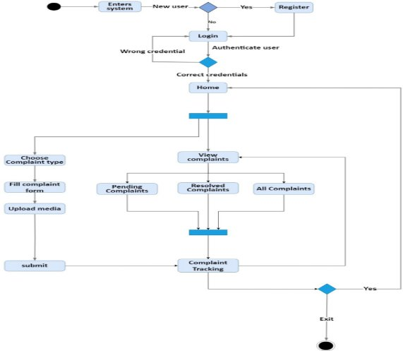

*Figure 5.1 Citizen Activity Diagram*

- When the user visits the app for the first time, he/she first has to register for the app.
- After the successful registration, users will have to log in to their account.
- After successful login, the user will be redirected to the home screen, where he can select any type of complaint or can view complaints.
- When the user clicks on any type of complaint, they are presented with a form to file the complaint.
- User fills out the complaint form along, including any relevant media, and submits it.
- Once the form is submitted, the user will be redirected to the complaint tracking page.
- The user is provided with three buttons to show complaints, such as, pending, resolved and all complaints, user clicks on any of the button and can filter complaints according to their status.

**Admin Activity Diagram**

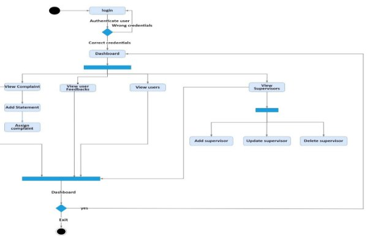

*Figure 5.2 Admin Activity Diagram*

- `  `Admin will log in to the dashboard.
- After logging in, the admin can view system statistics and performance through charts and graphs for better measurement.
- ` `Admin will have the option to view complaints, users, supervisors, user’s feedback, and statistics.
- When the admin clicks on view complaints, he will further add the statement to the existing complaint and assign it to the relevant supervisor.
- When the admin clicks on view users, all the registered users will be visible to him.
- Admin can view, add, update, and delete any supervisor when he clicks on the view supervisor.

**Super Admin Activity Diagram**

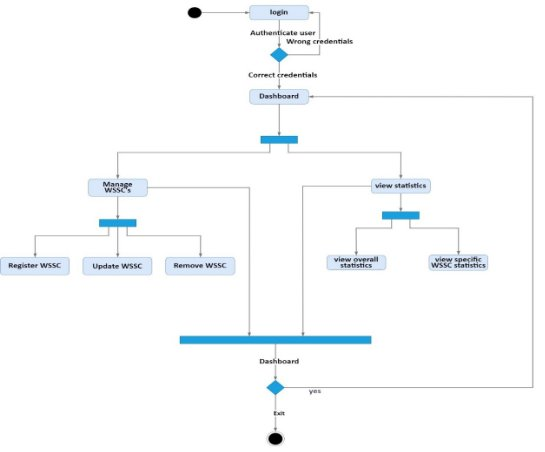* 

*Figure 5.3 Super admin Activity Diagram*

- Super Admin will log into the dashboard.
- Super Admin will have two main options, Manage WSSCs and View statistics.
- Super Admin can Add, update or remove WSSC When clicking on Manage WSSCs.
- Similarly, he can view overall statistics or any specific WSSC statistics, when clicking on view statistics

**Supervisor Activity Diagram**

*Figure 5.4 Supervisor Activity Diagram*

- Supervisor will login into the supervisor panel.
- Supervisor will view the complaint assigned to him by the admin.
- Once the Complaint has been resolved the supervisor will give the feedback to the admin.
### **5.3.2      Use case diagram**
An illustration of the interaction between actors and the system is a use case diagram. It is used to represent various use cases carried out by actors within the system.

**Citizen Use Case Diagram**

*Figure 5.5 Citizen use case*

- ` `A new user will have to register himself to the app.
- After signing in, the user can make a complaint, and once the complaint has been resolved, the user needs to give feedback.
- User can view and track the complaints.

**

**Admin Use Case Diagram**

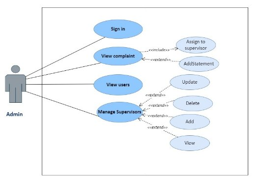

*Figure 5.6 Admin use case*

- Admin will sign in to the dashboard.
- After signing in, the admin can perform different functions.
- Admin can view the registered users, and the complaints by them.
- Admin can view the complaint, assign it to the supervisor, and add a statement if needed.
- Admin can perform CRUD operation on the supervisor.

**Supervisor Use Case Diagram**

*Figure 5.7 Supervisor use case*

- ` `Supervisor will sign in to the
- ` `Supervisor can view the complaints forwarded by the supervisor and add a response to it.

**Super Admin Use Case Diagram**

*Figure 5.8 Super Admin use case*

- Super admin will sign in to their dashboard.
- ` `Super admin can perform CRUD operation on WSSCs.
- Super admin can view overall statistics as well as can view a specific WSSCs statistics.

### **5.3.3      Entity Relationship Diagram**

*Figure 5.9 Entity Relationship diagram*

**Possible Entities**:

- User
  - Citizen
  - WSSC
  - Supervisor
- Complaints
- Team member
- Citizen Feedback
- Location
- WSSC statement
- Complaint Address
- Supervisor Response

We have done generalization for the user with disjoint, so the business rules will be as follows;

- A Citizen can file zero or many complaints but a specific complaint can be filed by or associated only with a specific citizen.
- Citizens can give one feedback at a time associated with the relevant complaint.
- Admin can forward or update zero or many complaints but a specific complaint can only be forwarded or updated by only one specific admin.
- Admin can manage one or more Supervisors: there must be at least one associated with a specific WSSC, but a specific Supervisor can only be managed by only one specific Admin.
- A Supervisor can handle zero or many complaints that are forwarded to him by admin but a specific complaint can be handled by only one specific supervisor.
- Supervisor can give one response associated with the complaint upon resolution of the complaint

# **Chapter-6:     Implementation and Testing** 
Implementation and testing phases are the next important phases of the software development life cycle. During the implementation phase, the whole focus is shifted from the planning, design, and requirements stage to the actual development of the system. We translate the design specification and requirements into functional software components and integrate them into a cohesive system. The implementation phase involves setting up necessary software tools, frameworks, and libraries.

The developers write the code according to the already defined system architecture based on the requirements gathered during the requirements gathering stage.
## **6.1      Implementation Tools** 
Tools that are used in the app are given below:

**• VS Code**: VS Code is a code editor.

• **Figma**: To design our system front-end prototypes.

• **FigJam**: We use it to brainstorm and organize our ideas.

• **GitLab**: Team contribution and project management.

• **Google** **Docs**: Organize, edit, and create our project documentation.

• **Trello**: We can visually organize projects, workflows, and tasks.

• **MS** **Visio**: We used it to design our system architecture diagrams.

• **Lucid**.**App**: For the team's contribution to the design of our system architecture diagram.

A detailed justification is given for each tool in methodology chapter 4
## **6.2      Implementation technology** 
**• Front-end**: React.js framework Next.js with PWA.

**• Back-end:** Node.js, Express.js.

**• Database**: MongoDB.
**
` `A detailed justification is given for each technology in methodology chapter 4
## **6.3      Folder Structure**
A well-structured folder hierarchy allows for easy navigation, locating specific files, and understanding of the project's overall architecture. It enhances collaboration among team members, reduces errors, and promotes scalability by accommodating future changes and additions to the project. Additionally, a clear folder structure improves code maintainability and makes it easier for new team members to onboard and understand the project structure.
### **6.3.1      TurboRepo (Root directory)**
We have used the TurboRepo tool [6] to efficiently handle and manage multiple apps within the same workspace. The project consists of three distinct apps: client, dashboard, and server, each residing in the app directory as depicted in Figure 6.1. By leveraging TurboRepo, we effortlessly track and manage each app, ensuring seamless organization and control.

*Figure 6.1 Folder Structure*
### **6.3.2      Client side** 
In the client-side folder structure, our project incorporates key elements for seamless development. The "app" directory enables dynamic routing in Next.js, while the "component" directory houses well-defined components. For effective global state management on the client side, we utilize the "global state" directory. 

Figure 6.2 offers a visual representation of the project's files and folder organization

*Figure 6.2 Folder Structure-client side*
### **6.3.3      Dashboard Folder Structure**
Similar to the client-side folder structure discussed earlier, the folder structure for the admin dashboard side is nearly identical, as depicted in Figure 6.2. It follows a similar organization, with an "app" directory for dynamic routing in Next.js, a "component" directory for component definition, and a "global state" directory for managing the global state on the admin dashboard side.

See the dashboard folder structure below Figure 6.3

*Figure 6.3 Folder Structure-dashboard*
### **6.3.4      Server-side Folder Structure**
Our server-side architecture follows the MVC (Model-View-Controller) pattern [7], ensuring a clean and efficient working environment. It includes directories for controllers, routes, and models, as well as other essential directories like middleware, validation, and types. This folder structure promotes smooth operations and enhances the functionality of our system.

See the server-side folder structure below, Figure 6.4

*Figure 6.4 Folder Structure-server side*
## **6.4      Visual Flow of the App**

The visual flow of the app is visually demonstrating how a user would navigate through the app highlighting the main screen, the interaction and the transitions they encounter along the way.

The first screen user encounters after opening the app is login screen.

### **6.4.1      Client side - Citizen**

**6.4.1.1      Login / Registration**

The first screen is the login/registration screen. If the user is not registered, they have to first register themselves. However, if the user is already registered, they can enter their login credentials to access the app. Figure 6.5 shows, Login/Registration screens.

`           `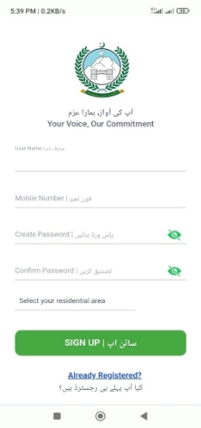      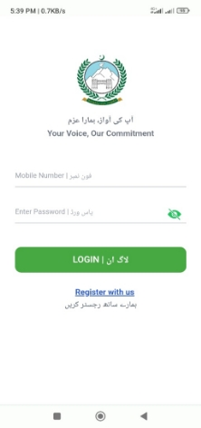

*Figure 6.5 Registration/login screen*

**6.4.1.2      Home screen**

After a successful login, the user is presented with the home screen, which offers various options for performing the following operations:

- selecting one of the complaint types to initiate filing a complaint
- Viewing all, pending, and resolved complaints
- Updating the profile.

Figure 6.6 shows the home screen of the app.

**6.4.1.3      Complaint form**

After clicking on any of the complaint types, the form appears to the user, the user fills out the form and submits it.

Figure 6.7 shows the Complaint registration form.

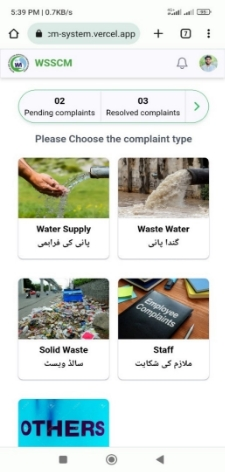      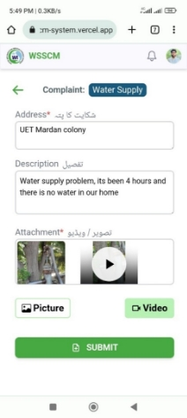

*Figure 6.7 Complaint form                           Figure 6.6 Home screen*

**6.4.1.4      Complaint tracking page**

After submitting the complaint form, user is redirected to the complaint tracking page, which displays the timeline of the complaint.

Figure 6.8 shows Complaint tracking page, that appears after filing complaint.

**6.4.1.5      View Complaints**

Once the complaint is submitted, the user can go back to the home screen and view the complaint history. In the complaint history section, the user has the option to filter complaints based on their current status.

Figure 6.9 shows all the complaint history.

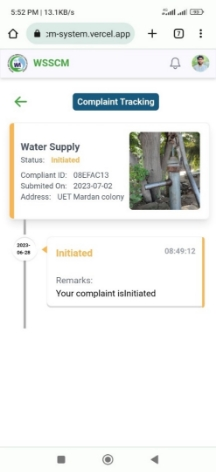       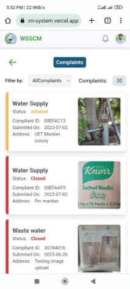

*Figure 6.8 Complaint tracking page         Figure 6.9 View complaints page*

**6.4.1.6      Update profile**

From the home screen, the user can navigate to the "Update Profile" section, where they can update their profile information.

Figure 6.10 shows update profile page for user.

*Figure 6.10 Update Profile*
### **6.4.2      Admin Dashboard**
The admin dashboard in the system serves as a centralized control panel for the administrators or authorized personnel responsible for managing and overseeing the complaint management process.

All the figures below show the admin dashboard and the flow of complaint assignments, as well as how they are assigned to supervisors and resolved, and the feedbacks from the citizens.

*Figure 6.11 Home page*

*Figure 6.12 All Complaints page*

*Figure 6.13 Specific complaint*

\* 

*Figure 6.14 View Supervisors page*

*Figure 6.15 Register supervisor* 

*Figure 6.16 View all feedback*

### **6.4.3      Supervisor Panel**
The supervisor is responsible for handling the complaint and resolving the issue. The admin assigns the complaint to a specific supervisor, and after that supervisor looks after that complaint.

*Figure 6.17 Supervisor’s sign-in* 

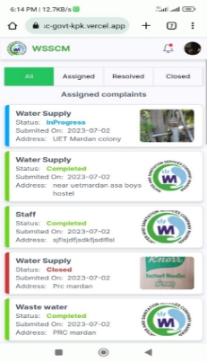     **

`     `*Figure 6.18 All complaints             Figure 6.19 Assigned complaints* 

` `*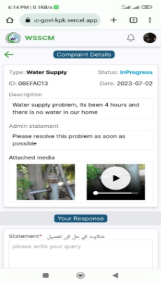*    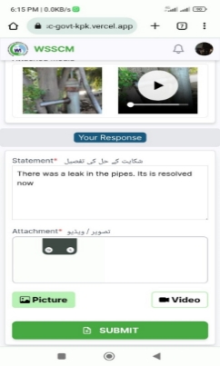

*Figure 6.20 Complaint details*

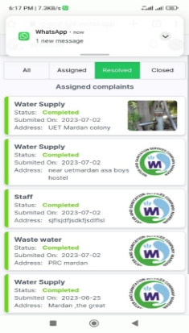      **

`  `*Figure 6.21 Resolved complaints         Figure 6.22 Supervisors profile card*
##
## **6.5      Testing  ** 
Testing plays an important role in the software development process to ensure the quality, reliability, and effectiveness of the software being developed. There are two main types of testing in the software development process.

1. White box testing
1. Black box testing
### **6.5.1      White box testing**
Involves examining the internal structure and implementation details of the system. Here the testers have access to the source code and are aware of the software's internal working. White box testing includes testing techniques such as code coverage analysis, unit testing, and code review.

We have done unit testing in our app for those components for which we felt that it is more critical. We have used Jest. 

**6.5.1.1      Jest**

Jest is a JavaScript testing framework that is used for unit testing in software development. It is designed for testing code, including applications, libraries, and frameworks. 

We performed unit testing using Jest. Figure 6.11 shows unit testing.

*Figure 6.23 Unit testing-1*

*Figure 6.24 Unit testing-2*
### **6.5.2      Black box testing**

Focuses on the external behavior of the system without considering the internal implementation. Testers evaluate the functionality based on the defined functional requirements, and they do not have any knowledge of the internal workings or behavior of the system. The tester selects a specific requirement, performs the test on the system according to that requirement, and gets the expected output, that output either fails or passes.

To perform black box testing, on our system, we have created some test cases and tested our app according to it. Below tables shows all the test cases for black box testing.

*Table 6.1 Test case for registration*

|Test case id|01|
| :- | :- |
|Functional Requirement|User Registration|
|Test Description|To test whether the user can register or not.|
|Steps|Enter all the fields required to register.|
|Expected Results|User should be registered after entering all the credentials.|
|Actual Results|The user is registered successfully|

*Table 6.2 Test case for login*

|Test case id|02|
| :- | :- |
|Functional Requirement|User Login|
|Test Description|To test whether the user can log in or not.|
|Steps|Enter your mobile number and password.|
|Expected Results|User should be logged in after entering the mobile number and password.|
|Actual Results|The user is logged in successfully|

*Table 6.3 Test case for filing complaint*

|Test case id|03|
| :- | :- |
|Functional Requirement|Make complaint|
|Test Description|To test whether the user can file a complaint or not.|
|Steps|Select the type of complaint and fill out the form to successfully file a complaint.|
|Expected Results|The complaint should be registered.|
|Actual Results|The complaint was registered successfully and the user is redirected to the complaint tracking page,|

*Table 6.4 Test case for update profile*

|Test case id|04|
| :- | :- |
|Functional Requirement|Update profile|
|Test Description|To test whether the user can update his profile or not.|
|Steps|Update the fields.|
|Expected Results|Fields the user changed should be updated in the system.|
|Actual Results|Changes made successfully.|

*Table 6.5 Test case for user feedback*

|Test case id|05|
| :- | :- |
|Functional Requirement|User Feedback|
|Test Description|To test whether the user's feedback is submitted or not.|
|Steps|Give feedback on the resolution of the complaint.|
|Expected Results|User's feedback should be successfully submitted.|
|Actual Results|Feedback submitted successfully|

#
#
#
#

# **Chapter-7: Results and Discussion** 
## **7.1      Results and Discussion Overview** 

Community clean-up addresses waste and water sanitation management and other complaint management issues in the cities where WSSC operates. It has gone through testing and assessment to evaluate its effectiveness and usability. 

The evaluation resulted in positive outcomes. First, the system got successful in digitalizing the working pattern of WSSCs, allowing the citizens to file complaints regarding garbage, sanitary issues, water supply, and other categories that fall under the purview of WSSC organizations. For users with varied levels of technological expertise, the system's user-friendly interface made it simple to navigate and register complaints. Additionally, the system effectively facilitated the interaction between the citizens and the WSSC organization's authority, streamlining the complaint management process.

The evaluation highlighted the advantages and shortcomings of the system. The system's ease of use greatly improved the user experience and promoted greater engagement in reporting problems. The overall WSSC authority responded more quickly as a result of the simplified complaint management procedures, which enhanced complaint resolution. Additionally, including multimedia features, such as the capability to upload media files, allowed for more thorough complaint submissions and offered visual proof for speedy problem identification and resolution.

However, certain challenges that came forward during the evaluation were that users can face difficulty in accessing the app, due to limited internet connectivity in different areas of Pakistan. Addressing this issue requires exploring solutions to enhance accessibility and ensure reliable connectivity across all regions.

We used the following usability approach for the effective evaluation of the system. There are many ways to perform usability testing but some of the common ways are;

**Remote usability testing**

Using screen-sharing or remote collaboration tools, participants undertake usability testing from their own location. This approach offers greater flexibility and geographic reach.

**Think-cloud usability testing**

Using this method, participants verbalize their ideas and behaviors, which enables researchers to comprehend their thought processes, frustrations, and areas of difficulty.

**Unmoderated usability testing**

Participants in unmoderated testing do tasks on their own without supervision. In most cases, participants are given guidelines or a task list and instructed to record their conversations while thinking aloud. This technique is frequently used for remote testing using specialized platforms or tools.

**Guerilla usability testing**

In guerilla usability testing, the user feedback on the system or the interface is collected in a fast and cost-effective manner. Typically conducted in open spaces or with a small group of participants, with no formal requirement in advance.

As our FYP has not been deployed yet, guerilla usability testing is the best approach in this case, allowing us to gather feedback from users in a quick and informal manner. We can approach potential users in a casual setting and observe their interaction with the system, rather than conducting formal and structured testing. This approach is more suitable when we have limited resources and time.
### **7.1.1      Guerilla Usability Testing**
To successfully perform guerilla usability testing, we visited different individuals inside and outside of our university,  invited them to visit our app, and provided their valuable feedback. This approach allowed us to gather a wide range of reviews and perspectives from different users.

These were a few questions asked by other users.

1. What is your first impression of the app’s user interface?
1. Can you easily navigate through the app's main features and functions?
1. Did you encounter any difficulties or confusion while performing any task?
1. How are you satisfied with the speed and responsiveness of the app?
1. Overall, how would you rate your experience using the app?`

overall, the average answers we got were;

*Table 7.1 Feedback Received from users* 

|1|The user interface is very clean, with clear icons and a visually appealing colour scheme.|
| :-: | :- |
|2|Yes, the navigation is straightforward and intuitive, with English and Urdu labels over each section.|
|3|No, there were no as such difficulties while using the app.|
|4|Satisfied with the speed and responsiveness of the app, loads quickly with smooth and responsive interactions.|
|5|Overall, the experience is positive, user-friendly, and visually appealing.|

#
#

# **Chapter-8:    Conclusion and Future Work** 
## **8.1      Conclusion** 
The community cleanup system in Pakistan addresses waste management and complaint management challenges. It uses a user-friendly web app to empower citizens to report complaints related to garbage, sanitation, water supply, and WSSC staff. The system streamlines the complaint filing process, enabling effective communication between citizens and the WSSC authority. The system's user-friendly interface and comprehensive registration form facilitate easy filing for users of varying technical expertise. However, further improvements are needed, such as reliable internet connectivity and ongoing monitoring and maintenance. The system's potential for improvement is significant, and further enhancements and refinements will further optimize its performance and impact in the future.
## **8.2      Future Work** 

In terms of future work, there are several areas that can be explored to further enhance the system and its impact. Some potential areas of focus include:

1\. 	Mobile Application Development: Developing a mobile application that complements the existing system would provide greater accessibility and convenience for users. This would allow citizens to file complaints, track their status, and receive updates on their mobile devices, enhancing user engagement and participation.

2\. 	Integration with Existing WSSCs: Ensuring seamless integration of the system with the existing workflow and processes of WSSCs is crucial. This involves collaborating with the WSSC authorities to establish data exchange protocols, integrate the complaint management system with their existing systems, and enable efficient communication and coordination between the system and WSSCs.

## 	
##
##
##
##

## **8.3      References**

[1]   U.S. Department of Commerce, "Country Commercial Guides: Pakistan -                           Waste Management." [Online]. Available:         <https://www.trade.gov/country-commercial-guides/pakistan/waste-management>.

[2]   “Brief on Solid Waste Management in Pakistan,” Ccacoalition.org. [Online]. Available:          <https://www.waste.ccacoalition.org/sites/default/files/files/brief-swm-_pak.pdf>.

[3]   “Smart waste management company,” Sensoneo, 13-Oct-2021. [Online]. Available: https://sensoneo.com/. 

[4]   S. Khattak, “New Safa Pekhawar app for Peshawar garbage, sewage problems,” Samaa, 02-Jan-2019. [Online]. Available:         https://www.samaaenglish.tv/news/1644307/. 

[5]   Timesofislamabad.com. [Online]. Available: https://timesofislamabad.com/03-Jan-2019/safa-pekhawar-kp-government-launches-yet-another-unprecedented-initiative-in-capital-peshawar. 

[6]   “Facebook,” Facebook.com. [Online]. Available: https://www.facebook.com/pmrukp/posts/marastyal-is-the-name-of-a-new-citizen-         centric-app-launched-by-pmru-govt-of-kp-t/2808874666094325/. 

[7]   “‎Marastyal,” App Store. [Online]. Available: 

`         `https://apps.apple.com/pk/app/marastyal/id1525173752. 

[8]   The Better India." [Online]. Available: https://www.thebetterindia.com/

[9]   Researchgate.net. [Online]. Available:                                                                                  https://www.researchgate.net/publication/350193293\_Mobile\_application\_model\_for\_solid\_waste\_collection\_management.

[10]   “Docs,” Nextjs.org. [Online]. Available: https://nextjs.org/docs. 

[11]   “Documentation,” Node.js. [Online]. Available: https://nodejs.org/en/docs. 

[12]   “Express 4.X - API reference,” Expressjs.com. [Online]. Available: https://expressjs.com/en/4x/api.html.

[13]   MongoDB, "MongoDB Atlas: Cloud Document Database," [Online]. Available: https://www.mongodb.com/cloud/atlas/lp/try4?                utm\_source=google&utm\_campaign= gs\_emea\_pakistan\_search\_core\_brand\_atlas\_desktop&utm\_term=mongodb&utm        \_medium=cpc\_paid\_search&utm\_ad=e&utm\_ad\_campaign\_id=12212624545&adgroup =115749718983&gclid=EAIaIQobChMI-8zg1Ojm.

[14]   Gitlab Inc, "About.gitlab.com," [Online]. Available: https://about.gitlab.com/.

[15]   Figma. "Figma: The Collaborative Interface Design Tool," Figma. [Online]. Available: https://www.figma.com/.

[16]   “Documentation for Visual Studio Code,” Visualstudio.com. [Online]. Available: https://code.visualstudio.com/docs.

[17]   “Manage your team’s projects from anywhere,” Trello.com. [Online]. Available: <https://trello.com/>.

[18]   “Intelligent diagramming,” Lucidchart. [Online]. Available: https://www.lucidchart.com/pages/landing? utm\_source=google&utm\_medium=cpc&utm\_campaign=\_chart\_en\_tier3\_mixed\_search\_brand\_phrase\_&km\_CPC\_CampaignId=1484560204&km\_CPC\_AdGroupID=60168112031&km\_CPC\_Keyword=%2Blucidchart%20%2Bapp&km\_CPC\_MatchType=b&km\_CPC\_ExtensionID=&km\_CPC\_Network=g&km\_CPC\_AdPosition=&km\_CPC\_Creative=442433233082&km\_CPC\_TargetID=kwd-79252617009&km\_CPC\_Country=9060980&km\_CPC\_Device=c&km\_CPC\_placement=&km\_CPC\_target=&gclid=Cj0KCQjw4s-kBhDqARIsAN-ipH1JGzE2CukUOplJnwDPNapmTUCP2PEhpM\_ROaz8IN3gP8EF6qH8TrcaAhvbEALw\_wcB.

[19]   “FYP-thesis,” Google Docs. [Online]. Available: https://docs.google.com/document/d/1mwyyaAZxF6a8qF06hCStE3Y3mqe7RFFIpiigWMZCFLs/edit.

[20]   "FYP Backend Repository," Postman Workspace, Team-Workspace~fcef3474-1b83-4ee1-862a-95cf7e895efa, Collection/23532273-e8265b4f-a8ac-4a0f-927a-a58d0061195f. [Online]. Available:

` `https://fyp-wsscm.postman.co/workspace/Team-Workspace~fcef3474-1b83-4ee1-862a-95cf7e895efa/collection/23532273-e8265b4f-a8ac-4a0f-927a-a58d0061195f.

**Annexure - A**

|S#|Attribute|Complex Problem|
Targeted

(Yes/No)
|Justification|
| - | - | - | - | - |
||Range of conflicting requirements|Involve wide-ranging or conflicting technical, engineering and other issues.|Yes|
Our system encountered a diverse set of requirements, each with its own unique demands and considerations.Multiple organizations, including TMA, WSSC, and PMRU had distinct objectives, processes, and priorities, leading to a wide range of conflicting requirements.

The challenge of collecting real requirements emerged due to the need to reconcile these conflicting demands and find common ground. Each organization had its specific needs and expectations, which sometimes diverged from one another. Balancing these conflicting requirements required careful negotiation, communication, and collaboration among stakeholders to arrive at a solution that satisfied the diverse range of interests involved.
|
||Depth of Analysis required|Have no obvious solution and require abstract thinking, originality in analysis to formulate suitable models.|Yes|
In pakistan , this is probably the first generic system developed for WSSCs in KPK. . We went through brainstorming process to do assumptions , then we verified those assumptions through prototyping.

Community cleanup provides the solution that is user friendly.

| 
||Depth of Knowledge required|Requires research-based knowledge much of which is at, or informed by, the forefront of the professional discipline and which allows a fundamentals-based, first principles analytical approach.|

Yes
|Utilizing a first principle analytical approach, assumptions are established to address complex engineering problems. Transparency emerges as a key assumption, demanding deeper investigation. To ensure transparency in complaint management, user visibility into complaint information, tracking, and timelines is crucial. Justifying the depth of knowledge required unveils core principles and actions necessary for effective problem resolution.|
||Familiarity of issues|Involve infrequently encountered issues|

Yes
|Waste and complaint management require a deep understanding of the challenges involved, including waste disposal, sanitation, water supply, and staff management. This familiarity allows for specialized knowledge and expertise to be applied, tailoring effective solutions to specific circumstances. By considering regulations, standards, and best practices, the complexities of waste and complaint management can be successfully addressed.|
||Extent of application codes|Are outside problems encompassed by standards and codes of practice for professional engineering.|Yes|The project requires a comprehensive and robust codebase to address various functionalities and system requirements. Extensive code coverage ensures scalability, maintainability, and adaptability for future enhancements. Additionally, intricate problem-solving demands an extensive codebase to handle complex business logic and integrations effectively.|
||Extent of stake-holder involved|Involve diverse groups of stakeholders with widely varying needs.|Yes|There are different stakeholders involved in this project, such as WSSCs, PMRU, Grey software , TMA.|
||Consequences|Have significant consequences in a range of contexts.|Yes|
By implementing effective waste management practices and enhancing citizen satisfaction, the project can contribute to a cleaner and healthier environment, promoting sustainable development and improving the overall quality of life in Pakistani cities.

|
||interdependence|Are high level problems including many component parts or sub problems.|Yes|Interdependence is justified in this project as various components of the system, such as complaint filing, tracking, and resolution, rely on each other for seamless functionality and effective complaint management. The interconnected nature of these components ensures a cohesive and integrated approach to address complex engineering challenges.|

65

